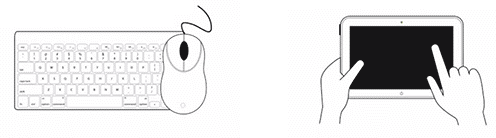
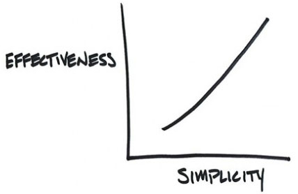
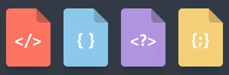
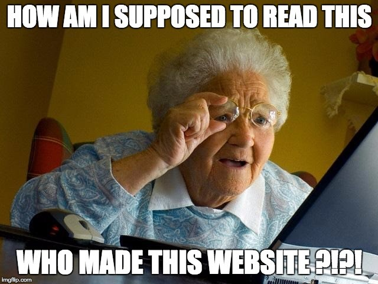

<!-- .slide: data-background-color="#005285" -->

WUNDERMAN

#**A11y**
## Web Content Accessibility Guidelines 2.0

 

Lucas Dasso - Tech Lead / Developer

<i class="fa fa-twitter" aria-hidden="true"></i> [@LucasDasso](https://twitter.com/lucasdasso)

 

September 2016

---

## What are the WCAG?

**WCAG** are part of a series of web accesibility guidelines published by the **Web Accessibility Initiative** (WAI).

The WAI in turn is part of the **World Wide Web Consortium** (W3C), the main international standards organization for the Internet.

Current WCAG version is 2.0.

### What is this for?

They are a set of guidelines that specify how to make content **accessible**, primarily for people with **disabilities** —but also for all user agents, including **highly limited devices**, such as mobile phones.

---
<!-- .slide: data-background-color="#005285" -->

## 4 Principles

1. Perceivable
2. Operable
3. Understandable
4. Robust

### 1. Perceivable

>Is all about the senses people use when browsing the web.

**Information** and **user interface** components must be presentable to users in ways **they can perceive**. 

**It can't be invisible to all of their senses.**

Note: Some of your users may have difficulties with one or more of their senses, making them reliant on assistive technology to browse your website.

#### Guidelines that apply

- Guideline 1.1: Text Alternatives
- Guideline 1.2: Time-based Media
- Guideline 1.3: Adaptable
- Guideline 1.4: Distinguishable

### 2. Operable

>Don’t limit user input to “mouse” or “pointers”.

Web designers must be aware of the different devices the users can manage to use the website, so they must **make** the **user interface** components and **navigation** elements in a way that **everyone can “operate” with it**.

#### Guidelines that apply

- Guideline 2.1: Keyboard Accessible
- Guideline 2.2: Enough Time
- Guideline 2.3: Seizures
- Guideline 2.4: Navigable

### 3. Understandable

>A perceivable and operable website means nothing
>if your users can’t understand it.

Your website must use **clear terms**, have **simple instructions** and **explain complex issues**.

#### Guidelines that apply

- Guideline 3.1: Readable
- Guideline 3.2: Predictable
- Guideline 3.3: Input Assistance

### 4. Robust

Content must be interpreted **reliably** by a wide variety of user agents, including **assistive technologies**.

This is the **most-technology-dependant** principle of all. It relies on the capacity of the website to be transmitted and interpreted by the user agents.

 
 #### Examples of user agents
 
 - Browsers (Internet Explorer, Firefox, Safari…).
 - Media players (Quicktime, Realplayer, Windows Media Player…).
 - Plugins (e.g. those that help your browser perform specific functions).
 - Other programs, including assistive technologies (pointers, magnifier, screen readers…).

 

#### Guidelines that apply

 - Guideline 4.1:  Compatible
 
 
---
<!-- .slide: data-background-color="#005285" -->

## 3 levels of   conformance

### Level A

A Web content developer **must** satisfy this checkpoint. 

### Level AA

A Web content developer **should** satisfy this checkpoint.

### Level AAA

A Web content developer **may** address this checkpoint.

### Level A - "Must"

The most basic web accessibility features.

Achieve a **minimum level of accessibility** through **markup, scripting, or other technologies** that interact with or enable access through user agents, including assistive technologies.

#### Success criteria 

<ul>
	<li class="fragment">**High** impact on a **broad** array of user populations.</li>
	<li class="fragment">**Lowest** impact on the **presentation** and **business** **logic** of the site.</li>
	<li class="fragment">**Easiest** implementation.</li>
</ul>

### Level AA - "Should"

Deals with the biggest and most common barriers for disabled users.

Achieve an **enhanced level of accessibility** through one or both of the following:

<ol>
	<li>**Markup**, **scripting**, or other **technologies**.</li>
	<li>The **design** of the content and presentation.</li>
</ol>

#### Success criteria

<ul>
	<li class="fragment">**High** and **important** impact for users.
	 
	Sometimes only **specific user populations** will be impacted.</li>
	<li class="fragment">May impose **changes** to a system’s presentation or business **logic**.</li>
	<li class="fragment">**Reasonably** easy implementation.</li>
</ul>
	

### Level AAA - "May"

The highest (and **most complex**) level of web accessibility.

Achieve **additional** accessibility **enhancements** for people with disabilities.

#### Success criteria

<ul>
	<li class="fragment">Focused on **improvements** for **specific** user populations.</li>
	<li class="fragment">**Difficult** or expensive to **adhere to**, depending on **platform** limitations.</li>
	<li class="fragment">Are **not applicable** to **all** web resources.</li>
</ul>

---
<!-- .slide: data-background-color="#005285" -->

## Any questions so far?

---

<!-- .slide: data-background-color="#005285" -->
# Extras

## Suggested Reading

- [Introduction to Web Accessibility](http://webaim.org/intro/).
- [WebAIM's WCAG 2.0 Checklist](http://webaim.org/standards/wcag/checklist).
- [How to Meet WCAG 2.0](https://www.w3.org/WAI/WCAG20/quickref/).
- [Quick Reference: Web Accessibility Principles](http://webaim.org/resources/quickref/).
- [Inclusive Design 24](http://www.inclusivedesign24.org/): 24 1 hour video presentations on accessibility.
- [Constructing a POUR Website: Putting People at the Center of the Process](http://webaim.org/articles/pour/).
- [Designing for Screen Reader Compatibility](http://webaim.org/techniques/screenreader/).
- [Accesible calendar example](https://www.southwest.com/).

- [Visual Disabilities](http://webaim.org/articles/visual/).
- [Web Accessibility for Designers](http://webaim.org/resources/designers/).
- [Screen Reader User Survey #6 Results](http://webaim.org/projects/screenreadersurvey6/).
- [ARIA Examples](http://heydonworks.com/practical_aria_examples/).
- [Periodic Table of ARIA 1.0 Roles](http://dylanb.github.io/periodic-aria-roles.html).
- [Google | Introduction to Web Accessibility. Video course](https://webaccessibility.withgoogle.com/course).
- [Accessibility Wins Showcase](https://a11ywins.tumblr.com/).
- [WebAIM Blog](http://webaim.org/blog/).
- [The Accessibility Cheatsheet](https://bitsofco.de/the-accessibility-cheatsheet/).
- [Aaron Cannon, Blind Web Developer](https://vimeo.com/1157346).
- [Jamaican Vacation Hoax](https://www.youtube.com/watch?v=23H8IdaS3tk). About automatic captions fails.

## Tools

- [WAVE: Web Accessibility evaluation tool](http://wave.webaim.org/) ([Chrome add-on](https://chrome.google.com/webstore/detail/wave-evaluation-tool/jbbplnpkjmmeebjpijfedlgcdilocofh)).
- [Colour Contrast Analyzer](http://webaim.org/resources/contrastchecker/) ([PC](https://github.com/ThePacielloGroup/CCA-Win/releases/) / [MAC](https://github.com/ThePacielloGroup/CCA-OSX/releases/)).
- [Colour Contrast Analyzer by accessibility.oit.ncsu.edu chrome add-on](https://chrome.google.com/webstore/detail/color-contrast-analyzer/dagdlcijhfbmgkjokkjicnnfimlebcll?utm_source=chrome-app-launcher-info-dialog).

- [NVDA: free screen reader](http://www.nvaccess.org/)
	- [Extra Voices for NVDA](https://github.com/nvaccess/nvda/wiki/ExtraVoices)

---

<!-- .slide: data-background-color="#005285" -->

	
---

##Thank You!

### Questions?

 
 
<small>[http://bit.ly/2cGcgX4](http://bit.ly/2cGcgX4)</small>

